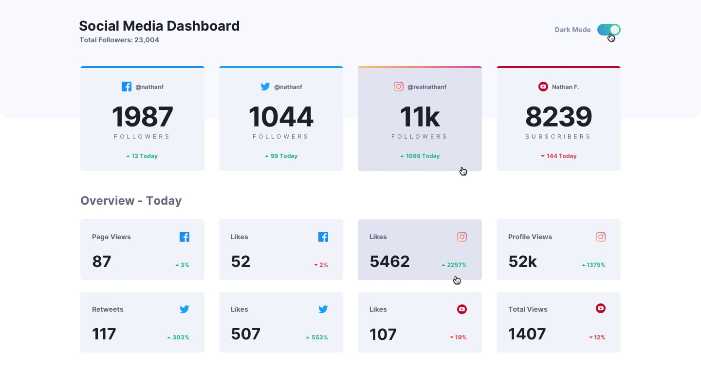
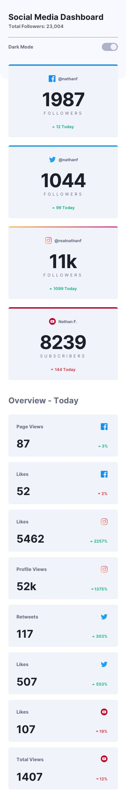

# Frontend Mentor - Solución: Dashboard de Redes Sociales con Switch de Tema Oscuro

Esta es mi solución al reto **Social Media Dashboard With Theme Switcher** de Frontend Mentor. Este proyecto se enfoca en construir un dashboard completamente responsivo de métricas de redes sociales con un sistema interactivo de cambio de tema (modo claro/oscuro) utilizando HTML semántico, CSS moderno y JavaScript puro.

El reto fue una excelente oportunidad para practicar layouts responsivos, componentes personalizados (toggle), implementación de dark mode, manipulación del DOM, mejoras de accesibilidad y arquitectura frontend escalable sin usar frameworks ni librerías externas.

---

## Tabla de contenidos
- [Resumen](#resumen)
- [El reto](#el-reto)
- [Diseño](#diseño)
- [Enlaces](#enlaces)
- [Mi proceso](#mi-proceso)
- [Construido con](#construido-con)
- [Lo que aprendí](#lo-que-aprendí)

---

## Resumen
Este proyecto es un dashboard responsivo de redes sociales que muestra métricas clave como seguidores, likes, vistas de página y estadísticas de interacción en diferentes plataformas como Facebook, Twitter, Instagram y YouTube.

También incluye un **interruptor de tema (modo oscuro/claro)** que permite alternar entre estilos visuales dinámicamente usando JavaScript y manipulación de clases CSS.

La interfaz es completamente responsiva y se adapta correctamente a dispositivos móviles, tabletas y escritorio.

Todo el estilo fue construido usando técnicas modernas de CSS como Flexbox, variables CSS, gradientes, pseudo-elementos y media queries. La interactividad se implementó con JavaScript puro mediante manipulación del DOM y programación basada en eventos.

---

## El reto
Los usuarios deben poder:

- Ver el diseño óptimo según el tamaño de pantalla de su dispositivo.
- Alternar entre modo claro y modo oscuro.
- Ver estados de hover y focus en elementos interactivos.
- Navegar la interfaz mediante teclado.
- Visualizar un dashboard completamente responsivo.
- Interactuar con un componente personalizado de cambio de tema.
- Disfrutar de una interfaz accesible y bien estructurada semánticamente.

---

## Diseño

- Diseño de escritorio (Modo claro)

- Diseño de escritorio (Modo oscuro)

- Estados activos (Modo claro)

- Estados activos (Modo oscuro)

- Diseño móvil (Modo claro)

- Diseño móvil (Modo oscuro)

---

## Enlaces
- URL del repositorio: [GitHub Repository](https://github.com/mlopezl/social-media-dashboard-with-theme-switcher)
- Sitio en vivo: [Live Demo](https://mlopezl.github.io/social-media-dashboard-with-theme-switcher/)

---

## Mi proceso
- Estructuré el layout usando elementos de **HTML5 semántico** como `main`, `section`, `header` y `article`.
- Seguí un enfoque **mobile-first**, mejorando progresivamente el diseño con media queries.
- Construí layouts responsivos utilizando **Flexbox** para alineación y distribución.
- Usé **variables CSS** para crear un sistema de diseño reutilizable y escalable.
- Implementé un sistema de **tema claro/oscuro** usando la clase global `.dark`.
- Creé un switch personalizado usando HTML y pseudo-elementos en CSS.
- Utilicé la metodología **BEM** para una nomenclatura de clases clara y escalable.
- Añadí interactividad con JavaScript mediante eventos:
  - `change`
  - `keydown`
- Gestioné el estado de la interfaz usando `classList` y manipulación del DOM.
- Mejoré la accesibilidad con soporte de teclado y manejo de foco.
- Utilicé HTML semántico para mejorar la estructura, legibilidad y SEO.
- Mantuve la separación de responsabilidades entre estructura (HTML), estilos (CSS) y comportamiento (JavaScript).

---

## Construido con
- HTML5
- CSS3
- JavaScript (ES6)
- Flexbox
- Variables CSS
- Flujo de trabajo mobile-first
- Diseño responsivo
- Metodología BEM
- Manipulación del DOM
- Event listeners
- Accesibilidad con teclado
- Gradientes CSS
- Pseudo-elementos CSS
- Media queries

---

## Lo que aprendí
- Construir un sistema completo de **modo claro/oscuro** usando clases CSS y JavaScript.
- Estructurar interfaces complejas con **HTML5 semántico**.
- Crear CSS escalable y mantenible utilizando la metodología **BEM**.
- Usar variables CSS para centralizar colores, sombras y gradientes.
- Construir componentes personalizados como switches interactivos.
- Manejar interacción del usuario con eventos de JavaScript (`change`, `keydown`).
- Mejorar accesibilidad con navegación por teclado.
- Usar pseudo-elementos (`::before`) para crear efectos avanzados sin HTML adicional.
- Diseñar interfaces responsivas con enfoque **mobile-first**.
- Mejorar la experiencia de usuario con transiciones, hover y feedback visual.
- Escribir código frontend limpio, modular y sin frameworks manteniendo una buena arquitectura.